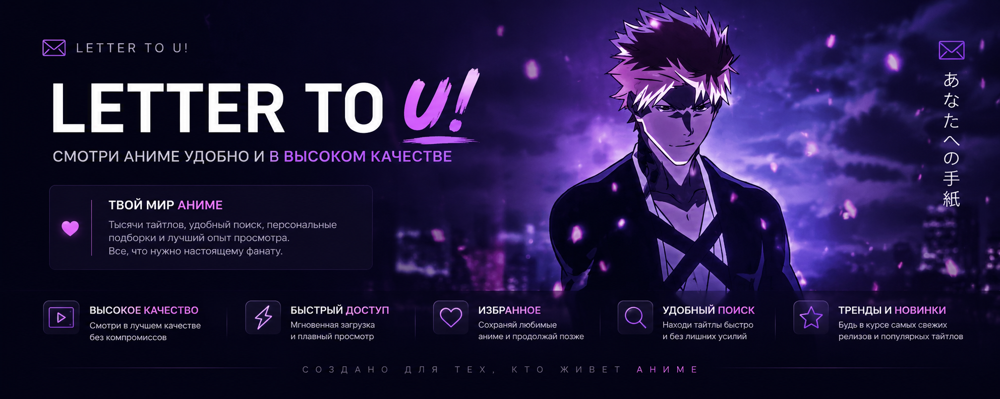

<div align="center">



# 「 UBUYASHIKI 」

### *Твое письмо в мир аниме.*

<p>


</p>

> ***"Каждое аниме — это история. Каждая история начинается с письма."***

</div>

---

# ✦ Что такое Ubuyashiki?

**Ubuyashiki** — это современная платформа для просмотра аниме, созданная для тех, кто ценит красивый интерфейс, высокое качество видео и удобство.

Никакого перегруженного дизайна.

Только атмосфера, плавные анимации, быстрый поиск и тысячи тайтлов в одном месте.

---

# ⚔ Возможности

### 🎬 Смотреть аниме
Смотри любимые тайтлы в высоком качестве без лишних действий.

### 🔍 Быстрый поиск
Находи нужное аниме за считанные секунды.

### ❤️ Избранное
Добавляй любимые произведения и возвращайся к ним когда угодно.

### 📖 Подробные страницы
Полная информация о каждом аниме: описание, жанры, рейтинг, студия и многое другое.

### 🔥 Популярное
Следи за тем, что сейчас смотрит всё сообщество.

### ✨ Современный интерфейс
Минимализм, плавные анимации и эстетика, вдохновленная современными веб-приложениями.

---

# ⚡ Стек технологий

```text
Frontend
├── Next.js
├── React
├── TypeScript
├── Tailwind CSS
├── shadcn/ui
├── reactuse
└── Tanstack Query

Backend
├── FastAPI
├── Python
└── Kodik API
```

---

# 🌌 Философия проекта

> Мир аниме огромен.

Ubuyashiki создается не просто как очередной сайт для просмотра.

Это место, где хочется остаться.

Где интерфейс не отвлекает от истории.

Где каждая деталь существует не случайно.

---

# 🗺 Roadmap

- ✅ Главная страница
- ✅ Страница просмотра аниме
- ✅ Популярные тайтлы
- ⏳ Поиск
- ⏳ Авторизация
- ⏳ История просмотров
- ⏳ Комментарии
- ⏳ Персональные рекомендации
- ⏳ Коллекции
- ⏳ PWA

---

# 📸 Галерея

> Скоро здесь появятся скриншоты интерфейса.

---

# ⭐ Поддержать проект

Если проект тебе понравился — поставь ⭐ этому репозиторию.

Это лучшая мотивация продолжать разработку.

---

<div align="center">

## 「ありがとう。」

### *Добро пожаловать в мир Ubuyashiki!*


</div>
